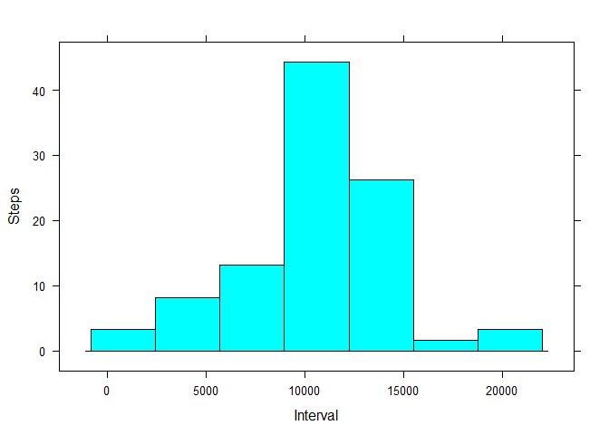

# Reproducible Research: Peer Assessment 1


## Loading and preprocessing the data

Set the working directory to the correct folder.

Read the Fitbit data into the "activityData" variable.


```r
setwd("C:/Users/Mothballs/datasciencecoursera")

activityData <- read.csv("activity.csv")
```

## What is mean total number of steps taken per day?

Aggregate summed steps by date into the "stepsDate" variable.

Subset the steps column into the "steps" variable.

Calculate mean and median values and assign them into the "meanSteps" and "medianSteps" variables.

Load the Lattice plotting system and create a histogram for total steps per date.


```r
stepsDate <- aggregate(steps ~ date, activityData, sum)

steps <- stepsDate[, 2]

meanSteps <- mean(steps, na.rm=TRUE)

medianSteps <- median(steps, na.rm=TRUE)

print(meanSteps)
```

```
## [1] 10766.19
```

```r
print(medianSteps)
```

```
## [1] 10765
```

```r
library("lattice")

histogram(steps, 
          xlab="Interval", 
          ylab="Steps")
```

 

## What is the average daily activity pattern?

Aggregate mean steps per interval into the "meanStepsPerInterval" variable.

Determine which row contains the maximum # of steps and assign the value to the variable "maxStepRow."

Use maxStepRow to find the interval associated with that row containing the maximum number of steps and assign the value to the "intervalMaximum" variable.

Load ggplot2 plotting system into R and create a time series plot for mean steps per interval.


```r
meanStepsPerInterval <- aggregate(steps ~ interval, activityData, mean)

maxStepRow <- which.max(meanStepsPerInterval$steps)

intervalMaximum <- meanStepsPerInterval[maxStepRow,1]

print(intervalMaximum)
```

```
## [1] 835
```

```r
library("ggplot2")

ggplot(meanStepsPerInterval, aes(interval, steps)) + geom_line() + xlab("Interval") + ylab("Steps")
```

 

## Imputing missing values

Sum the amount of rows in the step column with "NA" as a value and assign into the "noData" variable.

Create a second dataset ("filledData") as a duplicate of activityData.

Replace NA step values in filledData with the mean # of steps for the row's interval as calculated from activityData.

Aggregate steps by date into the "filledStepsDate" variable and subset the "step" column from that variable into "filledSteps".

Calculate the mean and median of the filled data set into the variables "meanFilledSteps" and "medianFilledSteps."

Create a histogram for filledSteps.


```r
noData <- sum(is.na(activityData))

filledData <- activityData

filledData$steps[is.na(filledData$steps) & filledData$interval == meanStepsPerInterval$interval] <- meanStepsPerInterval$steps

filledStepsDate <- aggregate(steps ~ date, filledData, sum)

filledSteps <- filledStepsDate[, 2]

meanFilledSteps <- mean(filledSteps, na.rm=TRUE)

medianFilledSteps <- median(filledSteps, na.rm=TRUE)

print(meanFilledSteps)
```

```
## [1] 10766.19
```

```r
print(medianFilledSteps)
```

```
## [1] 10766.19
```

```r
histogram(filledSteps, 
          xlab="Interval", 
          ylab="Steps")
```

 

## Are there differences in activity patterns between weekdays and weekends?

Create a function ("periodOfWeek") to determine the day of the week for each date and add an aditional row value ("weekend" or "weekday") according to day of the week.

Use sapply to apply the function and add a column containing the period of the week to filledData.

Plot steps by interval for both week periods.


```r
periodOfWeek <- function(date) {
    if (weekdays(as.Date(date)) %in% c("Saturday", "Sunday")) {
    
       "weekend"
       
    } 
  else {
  
      "weekday"
      
    }
}

filledData$periodOfWeek <- as.factor(sapply(filledData$date, periodOfWeek))

xyplot(steps ~ interval|periodOfWeek, 
           data = filledData,
           type = "l",
           xlab = "Interval",
           ylab = "Number of steps",
           layout=c(1,2))
```

 
